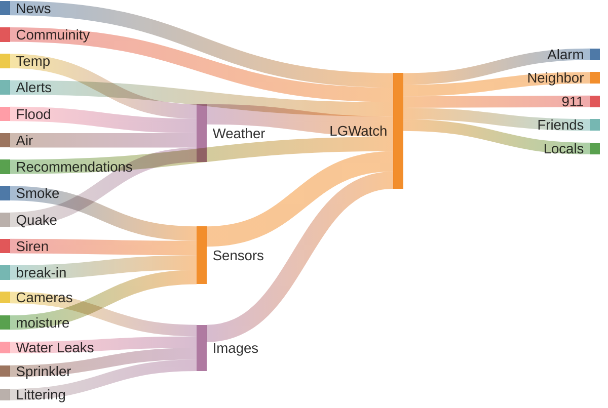
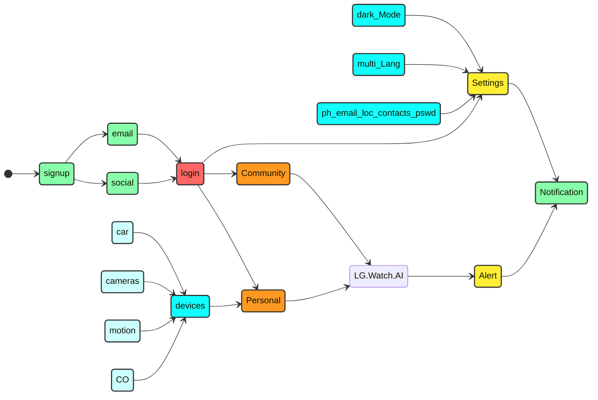
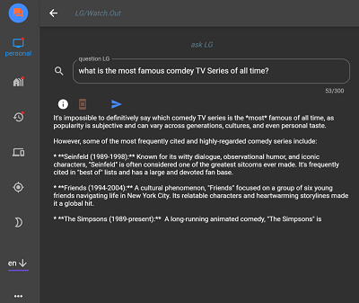
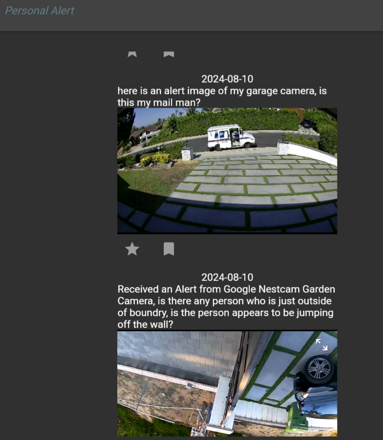
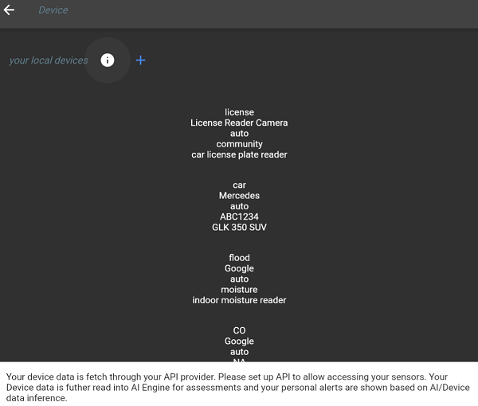
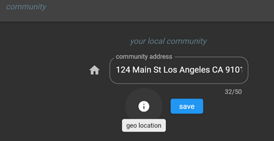

# LG.Watch.Out

`while you're watching LG, let LG watch out for you.`

## Objective
An AI-powered live alert LG webOS app, which reads, understands with advance AI Reasoning capabilities and watch out for you.

click here for a live [demo](https://amitxshukla.github.io/LGWatch/) and [video]().

## Tools
	Backend: Firebase
	UI/UX: Flutter
	AI: GROQ, BYOA (bring your own AI, Anthropic, Gemini, OpenAI ..)
	Platform: LGWebOS

## Process flow

## sample App images

